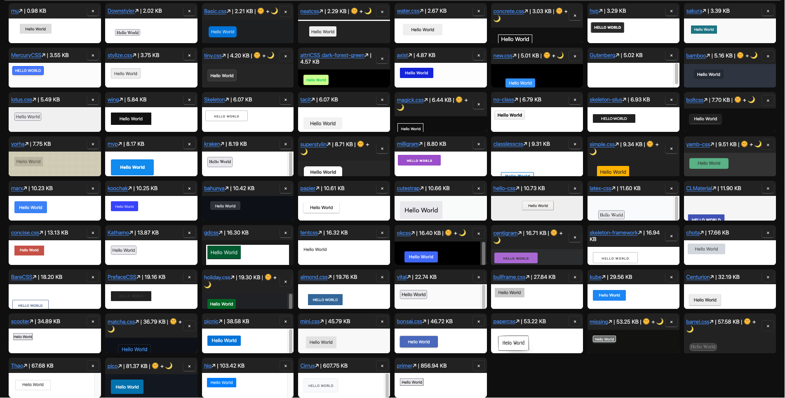

# Classless CSS Framework Previews

Preview 69 different classless css frameworks side by side.

View the app [here](https://classless-css-previews.vercel.app/)

Each framework is loaded via CDN from jsdelivr (initial page load will take a second 😉).

To make it on to this list, the framework must at least style a button element by default with no classes.

Thanks to [dbohdan/classless-css](https://github.com/dbohdan/classless-css) for the original list of frameworks.
